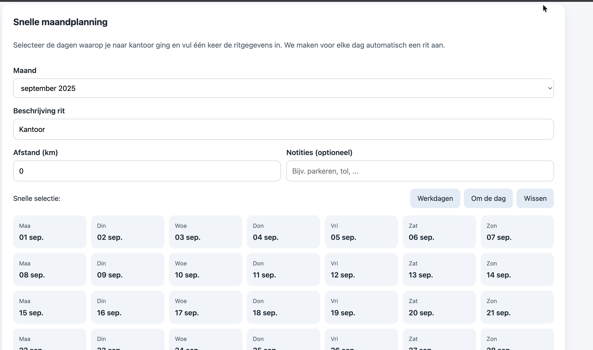

# Kilometerregistratie

Een lichte React-app om al je ritten bij te houden en maandelijks als PDF te exporteren.

## Snel starten

1. Installeer de dependencies:
   ```bash
   npm install
   ```
2. Start de ontwikkelserver:
   ```bash
   npm run dev
   ```
3. Open de getoonde lokale URL in je browser.

### Via Docker Compose

1. Bouw en start de ontwikkelcontainer:
   ```bash
   docker compose up --build dev
   ```
   De Vite-server draait dan op <http://localhost:5173>. Bestandswijzigingen op je host worden automatisch opgepakt.

2. Een geoptimaliseerde build in Nginx draaien kan met:
   ```bash
   docker compose up --build prod
   ```
   Daarmee wordt de gecompileerde app geserveerd op <http://localhost:8080>.

### GitHub Actions / GitHub Container Registry

1. Maak een GitHub-repository aan (bijv. `kilometers`) en push deze code ernaartoe.
2. Zodra je op `main` pusht, zal de workflow in `.github/workflows/docker-image.yml` automatisch een productie-image bouwen en publiceren naar `ghcr.io/<owner>/kilometers:latest`.
3. Stel lokaal de variabele `KILOMETERS_IMAGE` in zodat `docker-compose` dezelfde image gebruikt:
   ```bash
   export KILOMETERS_IMAGE=ghcr.io/<owner>/kilometers:latest
   docker compose pull prod
   docker compose up prod
   ```
   Vervang `<owner>` door je GitHub-gebruikersnaam of organisatie. Authenticatie voor GHCR kan met `echo $CR_PAT | docker login ghcr.io -u <owner> --password-stdin` indien nodig.

## Functionaliteiten

- Snel formulier om datum, beschrijving, afstand en notities vast te leggen
- Automatisch gegroepeerd per maand inclusief totalen
- Opslag in de browser (ritten en factuurgegevens blijven bewaard)
- Factuurkop eenvoudig aanpasbaar (datum, nummer, bedrijfsnaam, kenteken, tarief, btw)
- Maandplanner: klik de dagen dat je naar kantoor ging en maak alle ritten in één actie aan
- Eén knop om de geselecteerde maand als `jsPDF`-rapport te downloaden
- Responsief ontwerp dat prettig werkt op desktop en mobiel

## PDF-export

Bestandsnamen volgen het patroon `kilometers-JJJJ-MM-JJJJMMDD-HHmm.pdf`, handig voor een maandelijks archief. Notities worden opgenomen in de tabel.

## Schermafbeelding



## Technische stack

- [React 18](https://react.dev/)
- [Vite](https://vitejs.dev/)
- [TypeScript](https://www.typescriptlang.org/)
- [jsPDF](https://github.com/parallax/jsPDF) in combinatie met [jspdf-autotable](https://github.com/simonbengtsson/jsPDF-AutoTable)

Pas gerust de styling of het datamodel aan zodat het naadloos aansluit op jouw manier van kilometerregistratie.
